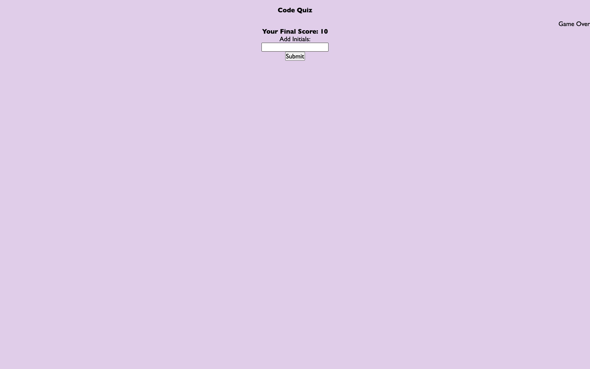

# code-quiz
Ready to take a quiz? This app runs in the browser and features dynamically updated HTML and CSS powered by JavaScript code that. It has have a clean, polished, and responsive user interface. 

## Description
In this project, I have created a code timed quiz on JavaScript fundamentals that stores high scores so that I can gauge my progress compared to my peers. When the user clicks the start button, a 60 second timer starts and I see the first question.  If the user answers correctly, the text will briefly turn green and the score will increase by 5 points.  If the user answers incorrectly, the text will briefly flash red and 10 seconds is subtracted from the clock. When all questions are answered OR the timer reaches 0, the game is over.  The user then is able to enter their initials and see the high scores.

## Installation
NA

## Usage
This quiz allows users to test their knowledge on JavaScript and understand their progress compared to their peers.

## Credits
NA

## License

Please refer to the LICENSE in the repo.

## Screenshots

## Link to Deployed Website
[Link](https://sely1724.github.io/code-quiz/)
